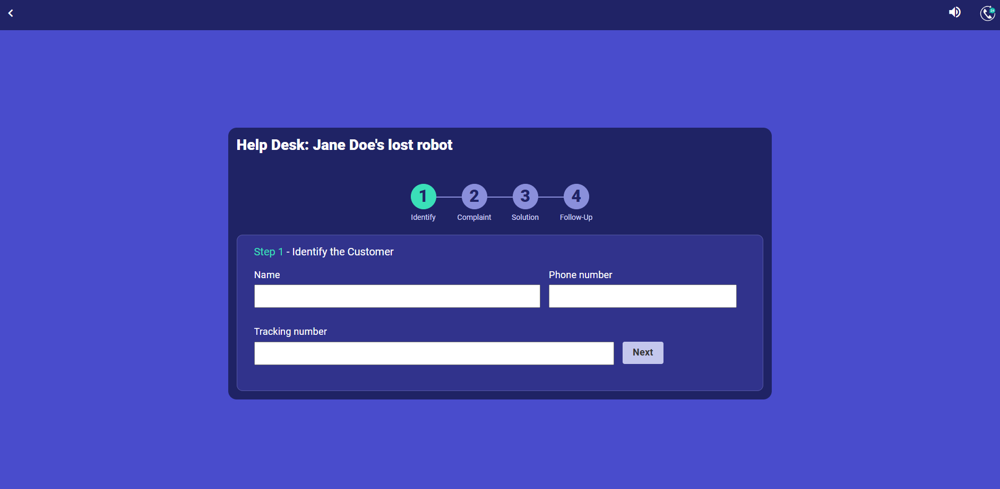
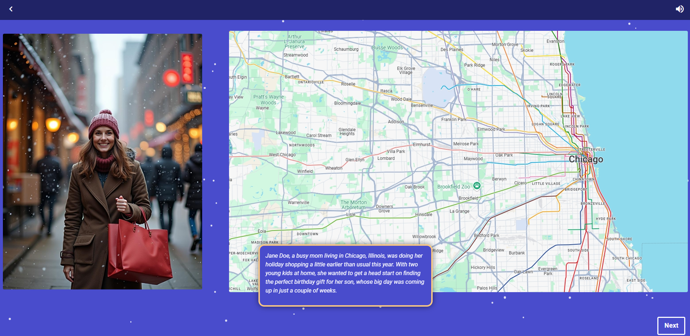
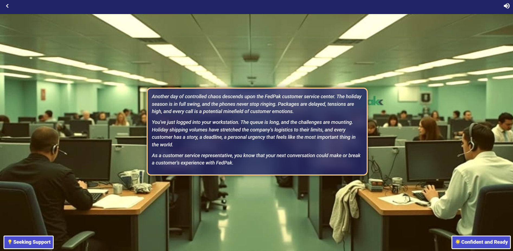
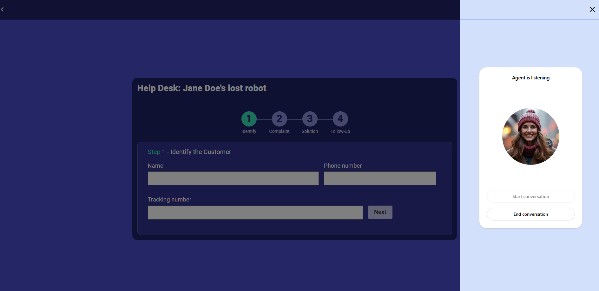
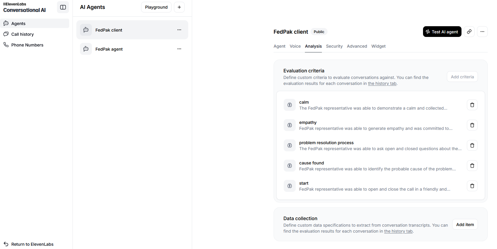
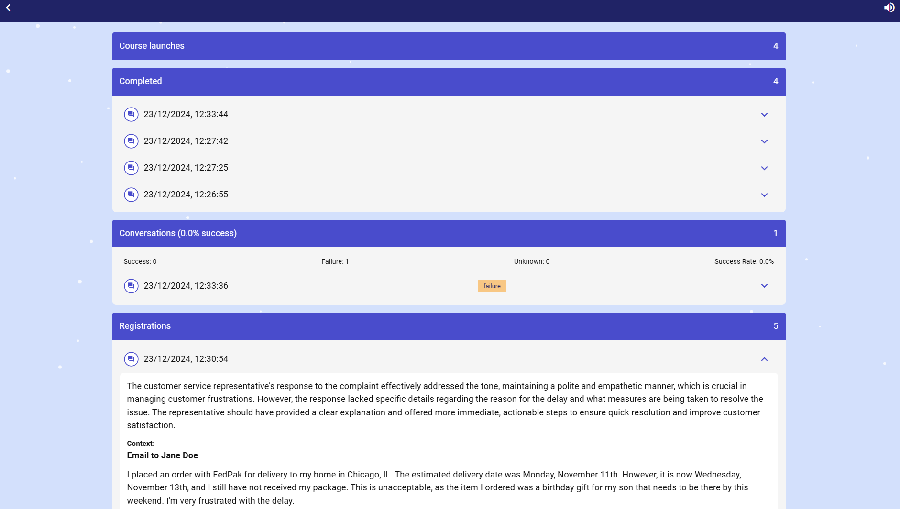

# December 2024 eLearning Challenge: Assisting Customers with Lost & Delayed Holiday Orders

[Live demo](https://elearningacademy.vercel.app/12-2024/fedpak-course/) ✨

La comunidad de [Elearning academy](https://community.elearningacademy.io/c/design-challenges/) prepara cada mes un desafío dónde se puede participar y compartir un proyecto junto a otros colegas.

Si bien la mayoría de los proyectos se realizan con herramientas de autor conocidas, principalmente la suite de [Articulate](https://www.articulate.com/), me propuse realizar el reto usando el [framework de adaptlearning](https://github.com/adaptlearning/adapt_framework/).

No tengo nada en contra de las herramientas comerciales, simplemente estaba seguro de que iba a sentirme con mayor confianza utilizando una herramienta como adaptlearning con la que estoy más familiarizado.

## La idea inicial 💡

Cuando vi la publicación del [challenge](https://community.elearningacademy.io/c/design-challenges/december-2024-elearning-challenge-assisting-customers-with-lost-delayed-holiday-orders), recordé que había visto una demostración de [Elevenlabs](https://elevenlabs.io) sobre [agentes conversacionales impulsados por inteligencia artificial](https://elevenlabs.io/docs/conversational-ai/docs/introduction) y pensé que podía ver cómo ponerlo en práctica a través de un caso real. Y dado que el desafío era para capacitar a representantes de atención al cliente parecía que tenía sentido realizar el intento.

## El comienzo 🚀

Lo primero que quise hacer fue probar el agente de IA. Me registré en [Elevenlabs.io](http://Elevenlabs.io) y luego de un par de pruebas me pareció realmente bueno el producto: funcionó a la primera y en pocos pasos.

Lo malo fue que, en pocos minutos, había consumido gran parte del crédito gratis.
Sin embargo, no quería darme por vencido. Sabía que el sistema funcionaba, así que continué desarrollando el resto del proyecto.

## Las funcionalidades ⚙️



Elearning Academy facilitaba para el challenge materiales gráficos, ideas acerca de cómo presentar los contenidos o usar diferentes recursos. Todo muy bien preparado.

Elegí empezar por el CRM. Tomé las capturas de pantallas provistas, y pensé que al ser no tan complejas las podía replicar como un formulario de múltiples pasos.

Creé el componente en adaptlearning y luego de varias iteraciones fue quedando parecido al CRM de Fedpak (o no tan parecido pero para los fines didácticos alcanzaba).

Para ese momento, comencé a imaginar que no quería explicar las partes de la herramienta o cómo usar el CRM sino que el usuario se enfrente directamente a resolver un caso real de la empresa de logística.

## Storytelling 📖



Jane Doe aparecía en una captura del CRM junto a un número de transacción, y desde ahí se desarrolla la historia con Jane como protagonista realizando compras a través de Fedpak. Cuando el paquete no llega a tiempo, Jane contacta al servicio de atención al cliente.

En este punto, el usuario del curso de elearning asume el rol de representante de atención al cliente de Fedpak para brindar soporte.

## Branching 🌳



Se presenta el caso de Jane y el usuario tiene dos alternativas:

- Dar soporte usando el CRM y realizar la llamada a Jane (el agente conversacional de [elevenlabs](http://elevenlabs.io)).
- Realizar otras actividades previas como preparación y luego hacer el soporte.

Sinceramente, mi idea era proveer más y mejores materiales de soporte. Y ya estaba viendo que otros participantes los estaban usando muy bien en sus proyectos.

Al no tener experiencia en diseño instruccional no sabía muy bien cómo incluir los materiales, resumirlos, hacerlos didácticos. Entonces, opté por hacer unos ejercicios ya con un poco de miedo de no saber para dónde ir o de cómo unir eso con el caso de Jane y luego poder dar un cierre a todo el curso.

## Aplicación web personalizada para el Agente conversacional 🌐



Ya había probado el agente conversacional desde la web de ElevenLabs, pero para poder controlar mejor su funcionamiento  necesitaba crear mi propia aplicación web en [nextjs](https://nextjs.org/). Pude hacerlo siguiendo la [documentación](https://elevenlabs.io/docs/conversational-ai/guides/conversational-ai-guide-nextjs), clonando un proyecto ya existente de ElevenLabs.

Esto me devolvió la confianza, ya que al verlo integrado en el challenge, con la fotografía de Jane como avatar, daba la sensación de que realmente te estabas enfrentando al reto de dar soporte a alguien que te podía escuchar y responder (y también aunque no lo sepas en ese momento:  analizar).

Pero claro, estas últimas pruebas fueron consumiendo todo el crédito disponible. Estaba contento igual porque me gustaba el resultado, lo que estaba logrando hacer, aunque internamente me decía que no tendría mucho sentido presentar el proyecto si el agente no estaría disponible o sin crédito para poder funcionar.

## Agente conversacional IA y analítica 🤖



Al dar tantas vueltas y hacer pruebas con el agente conversacional de Elevenlabs vi que tenía la posibilidad de incluir un análisis de la conversación. Se podían definir ahí unos criterios de evaluación para que al finalizar la llamada sean procesados y analizados por la IA.

Me pareció algo muy potente y decidí incorporarlo definiendo 5 criterios :

- **Inicio**: El representante de FedPak fue capaz de abrir y cerrar la llamada de manera amigable y consultiva.
- **Causa identificada**: El representante de FedPak fue capaz de identificar la causa probable del problema basándose en las preguntas realizadas y el análisis de los datos del CRM.
- **Proceso de resolución**: El representante de FedPak fue capaz de hacer preguntas abiertas y cerradas sobre el proceso de pedido y los detalles recibidos como parte clave del proceso de resolución del problema.
- **Empatía**: El representante de FedPak fue capaz de generar empatía y se comprometió a encontrar una solución.
- **Calma**: El representante de FedPak fue capaz de demostrar una actitud tranquila y serena durante toda la conversación.

Esto permitía que, después de cada conversación, Elevenlabs guardara un historial con la transcripción de la llamada y el análisis de cada criterio. El sistema podía mostrar resultados de éxito, fracaso o desconocido, junto con una justificación que explicaba el motivo de cada evaluación.

Hasta ahí estaba perfecto pero pensaba cuánto mejor sería si este feedback podía volver al usuario que estaba realizando el curso y no dejarlo solamente dentro de la web de Elevenlabs.
Ahí es cuando decidí sumar [xAPI](https://github.com/adlnet/xAPI-Spec) como especificación para guardar datos.

## xAPI



Mi proyecto estaba desarrollado con adaptlearning y una aplicación de nextjs que se comunicaba con la API de ElevenLabs, pero quería que el participante del curso pudiera ver el feedback de la conversación. Para lograrlo, agregué algunas rutas API en la aplicación de nextjs (aunque no soy experto en este framework, lo he usado en algunos proyectos). 
Fui consultando con [v0](https://v0.dev/) para validar mi enfoque y, paso a paso, mediante pruebas, logré:

- configurar un [LRS de Veracity](https://lrs.io)  (lo conozco y ya lo había usado en otros proyectos)
- hacer que al terminar la llamada se envíe un statement con los datos
- agregar una api para guardar statements desde el curso
- agregar una api para consultar datos y obtener statements desde Veracity y mostrar en el curso

Las posibilidades del desafío se habían expandido considerablemente.

El branching (si el usuario va a ver material de soporte o va directo a la práctica de dar soporte) podía ser registrado…

La forma de usar el CRM podía ser registrada…

Cada ejercicio, si fue correcto, si fue incorrecto…

Registrar respuestas de los usuarios en los campos de texto tanto del CRM como de las actividades.

La cantidad de veces que se lanzaba el curso…

Eran demasiadas cosas. Me estaba esforzando, y también empecinando demasiado.

Necesitaba ordenarme. Descansar.

## Lápiz y papel 📝

La fecha de entrega se acercaba, me seguía gustando lo que había conseguido pero se veía aún muy desordenado y estéticamente le faltaban bastantes detalles.

Usar un lápiz y un papel para anotar mi siguiente tarea o bajar de mi mente lo que se me escapaba o todo aquello que necesitaba ir descartando fue lo que me ayudó a llegar al final.

Me fui dejando pequeñas notas:

- hacé que se genere un usuario aleatorio al lanzar el curso para que los que lo prueben no tengan que ingresar su nombre
- definí que verbos de xAPI vas a usar
- pasále el actor del curso a la aplicación de nextjs así podés registrar la llamada con ese actor
- pensá en meter audios
- confetti?
- como ya tenés ejercicios dónde el usuario tiene que responder a un cliente con un mensaje podrías hacer que esa respuesta sea analizada por otra IA
- y así..

## Datos 📊

xAPI tiene eso de darte la posibilidad de registrar cualquier evento pero claro hay que hacerlo. Nada se hace solo sin desarrollarlo y menos sin pensarlo antes o tener una estrategia de datos.

Había llegado a este punto sin haberlo pensado demasiado así que tome las siguientes decisiones:

- **launched**: cada vez que el curso/challenge es lanzado

```json
{
    "actor": {
        "objectType": "Agent",
        "name": "fedpak-tt8jstd",
        "account": {
            "homePage": "http://fedpak.com",
            "name": "fedpak-tt8jstd"
        }
    },
    "verb": {
        "id": "http://adlnet.gov/expapi/verbs/launched",
        "display": {
            "en-US": "launched"
        }
    },
    "object": {
        "id": "http://fedpak.com/activities/fedpak-course",
        "definition": {
            "name": {
                "en-US": "Assisting Customers with Lost & Delayed Holiday Orders"
            }
        }
    }
}
```

- **experienced:** cada vez que se hace una llamada y hay comunicación entre el usuario del curso y el agente conversacional de ElevenLabs

```json
{
    "actor": {
        "objectType": "Agent",
        "name": "fedpak-tt8jstd",
        "account": {
            "homePage": "http://fedpak.com",
            "name": "fedpak-tt8jstd"
        }
    },
    "verb": {
        "id": "http://adlnet.gov/expapi/verbs/experienced",
        "display": {
            "en-US": "experienced"
        }
    },
    "object": {
        "id": "http://fedpak.com/activities/fedpak-course/conversation",
        "definition": {
            "name": {
                "en-US": "FedPak Agent Conversation"
            }
        }
    },
    "context": {
        "extensions": {
            "http://fedpak.com/extensions/conversation-data": {
                "agent_id": "bgtC3IpvTrdloZiXRss9",
                "conversation_id": "XwtvvY2aeOFU60fMYqcw",
                "status": "done",
                "transcript": [
                    {
                        "role": "agent",
                        "message": "Hi, I'm Jane Doe. My order from FedPak is 2 days late.  What's the status?",
                        "time_in_call_secs": 0
                    },
                    {
                        "role": "user",
                        "message": "Hello Ms. Doe, thank you for reaching out. I apologize for the delay with your order. I'll be happy to help you track this down right away. Could you please provide your order or tracking number so I can look into this for you?",
                        "time_in_call_secs": 10
                    },
                    {
                        "role": "agent",
                        "message": "My tracking number is FP484766352637. It was supposed to arrive on Monday, November 11th, but it's now two days late and I'm really worried it won't arrive in time for my son's birthday.",
                        "time_in_call_secs": 22
                    },
                    {
                        "role": "user",
                        "message": "I completely understand your concern about getting this in time for your son's birthday. Let me check the status right away... I can see that there was a sorting delay at our regional facility. I'm escalating this as a priority delivery right now. When is your son's birthday? This will help me ensure we meet your timeline.",
                        "time_in_call_secs": 35
                    },
                    {
                        "role": "agent",
                        "message": "His birthday is this Saturday. I really need it by Friday at the latest. Is there any way you can guarantee that?",
                        "time_in_call_secs": 42
                    },
                    {
                        "role": "user",
                        "message": "Thank you for that information. I've marked this as urgent due to the birthday deadline, and I've arranged for expedited delivery. I can confirm that your package will be delivered tomorrow before noon. I'm also adding a $20 credit to your account for the inconvenience. Would you like me to send you a text message confirmation when the package is out for delivery tomorrow morning?",
                        "time_in_call_secs": 55
                    },
                    {
                        "role": "agent",
                        "message": "Yes, that would be wonderful! Thank you so much for your help and for the credit. I really appreciate you making this a priority.",
                        "time_in_call_secs": 62
                    },
                    {
                        "role": "user",
                        "message": "You're very welcome, Ms. Doe. I've set up the text notifications, and you'll receive updates at each delivery stage. Is there anything else I can help you with today? And please wish your son a happy birthday from FedPak!",
                        "time_in_call_secs": 75
                    },
                    {
                        "role": "agent",
                        "message": "No, that's all. Thank you again for your great help!",
                        "time_in_call_secs": 80
                    },
                    {
                        "role": "user",
                        "message": "Thank you for your patience, Ms. Doe. Have a wonderful day and enjoy the celebration with your son! Don't hesitate to reach out if you need anything else.",
                        "time_in_call_secs": 88
                    }
                ],
                "metadata": {
                    "start_time_unix_secs": 1734967934,
                    "call_duration_secs": 88,
                    "feedback": {
                        "overall_score": 5,
                        "likes": 1,
                        "dislikes": 0
                    }
                },
                "analysis": {
                    "evaluation_criteria_results": {
                        "start": {
                            "criteria_id": "start",
                            "result": "success",
                            "rationale": "The representative demonstrated excellent opening and closing practices, using a professional greeting, addressing the customer by name, and closing with genuine well-wishes and an open invitation for future assistance."
                        },
                        "problem_resolution_process": {
                            "criteria_id": "problem_resolution_process",
                            "result": "success",
                            "rationale": "The representative effectively gathered information, identified the issue, provided a clear solution with expedited delivery, and added value with text notifications and a credit for the inconvenience."
                        },
                        "calm": {
                            "criteria_id": "calm",
                            "result": "success",
                            "rationale": "The representative maintained a professional, composed demeanor throughout, providing clear, detailed responses and demonstrating confidence in the solution provided."
                        },
                        "empathy": {
                            "criteria_id": "empathy",
                            "result": "success",
                            "rationale": "The representative showed strong empathy by acknowledging the birthday deadline, expressing understanding of the customer's concerns, and going above and beyond with the account credit and birthday wishes."
                        },
                        "cause_found": {
                            "criteria_id": "cause_found",
                            "result": "success",
                            "rationale": "The representative quickly identified the sorting delay, explained it clearly, and immediately provided a solution with expedited delivery and tracking updates."
                        }
                    },
                    "call_successful": "success",
                    "transcript_summary": "A customer service interaction where Jane Doe reported a delayed FedPak order needed for her son's birthday. The representative handled the situation professionally, identifying the cause of delay, arranging expedited delivery, providing a courtesy credit, and setting up text notifications. The conversation demonstrated strong empathy, clear problem-solving, and excellent customer service, resulting in a satisfied customer."
                }
            }
        }
    }
}
```

- **completed:** cada vez que se completa un ejercicio o actividad dentro del curso

```json
{
    "actor": {
        "objectType": "Agent",
        "name": "fedpak-tt8jstd",
        "account": {
            "homePage": "http://fedpak.com",
            "name": "fedpak-tt8jstd"
        }
    },
    "verb": {
        "id": "http://adlnet.gov/expapi/verbs/completed",
        "display": {
            "en-US": "completed"
        }
    },
    "object": {
        "id": "http://fedpak.com/activities/fedpak-course/c-keep-learning-3",
        "definition": {
            "name": {
                "en-US": "Recognizing customer profiles"
            }
        }
    },
    "result": {
        "success": true,
        "completion": true
    }
}
```

- **responded:** cada vez que un usuario responde con un mensaje, o usa la función de mail/message en el CRM.

```json
{
    "actor": {
        "objectType": "Agent",
        "name": "fedpak-tt8jstd",
        "account": {
            "homePage": "http://fedpak.com",
            "name": "fedpak-tt8jstd"
        }
    },
    "verb": {
        "id": "http://adlnet.gov/expapi/verbs/responded",
        "display": {
            "en-US": "responded"
        }
    },
    "object": {
        "id": "http://fedpak.com/activities/fedpak-course/customer-response/0",
        "definition": {
            "description": {
                "en-US": "FedPak customer response"
            },
            "type": "http://adlnet.gov/expapi/activities/cmi.interaction",
            "interactionType": "long-fill-in"
        }
    },
    "result": {
        "response": "I understand your frustration, and I sincerely apologize for the inconvenience. Let me check the status of your shipment and explore every possible solution to ensure it reaches you as soon as possible. Could you please confirm your order number or tracking ID so I can assist you promptly?"
    },
    "context": {
        "extensions": {
            "http://fedpak.com/extensions/message-data": {}
        }
    }
}
```

- **registered:** cada vez que un usuario responde con un mensaje aparte de guardar *responded* procesamos el texto con la api de openai y un simple prompt para que nos devuelva otro statement con el feedback o una evaluación de la respuesta del usuario.

```json
{
    "actor": {
        "objectType": "Agent",
        "name": "fedpak-tt8jstd",
        "account": {
            "homePage": "http://fedpak.com",
            "name": "fedpak-tt8jstd"
        }
    },
    "verb": {
        "id": "http://adlnet.gov/expapi/verbs/registered",
        "display": {
            "en-US": "registered"
        }
    },
    "object": {
        "id": "http://fedpak.com/activities/fedpak-course/customer-response/0",
        "definition": {
            "description": {
                "en-US": "FedPak customer response"
            },
            "type": "http://adlnet.gov/expapi/activities/cmi.interaction",
            "interactionType": "long-fill-in"
        }
    },
    "result": {
        "response": "The representative's response appropriately addresses the customer's urgency and frustration by acknowledging their feelings and apologizing for the inconvenience, effectively setting a positive tone. They also accurately targeted the next step, asking for the order number or tracking ID to facilitate problem-solving. Lastly, the representative's commitment to exploring all possible solutions reassures the customer of their dedication to resolving the issue promptly. This response demonstrates good control over tone, an understanding of the issue, and a proactive approach to problem resolution."
    },
    "context": {
        "extensions": {
            "http://fedpak.com/extensions/message-data": {
                "title": "The demanding customer",
                "complaint": "This is unacceptable! I need my shipment today, not tomorrow. Fix it!",
                "message": "I understand your frustration, and I sincerely apologize for the inconvenience. Let me check the status of your shipment and explore every possible solution to ensure it reaches you as soon as possible. Could you please confirm your order number or tracking ID so I can assist you promptly?",
                "itemId": ""
            }
        }
    }
}
```

## Desechos 🗑️

- Había preparado una animación con [rivejs](https://rive.app/) porque quería probar usarlo e integrarlo en adaptlearning. Pero me resultó difícil de hacer o de que quede más o menos presentable y como me estaba robando demasiado tiempo tomé un lottie de lottiefiles luego de recibir un email acerca del [lottiefiles creator.](https://creator.lottiefiles.com/)
- Había armado una aplicación para hacer reportes personalizados del LRS que finalmente no incluí como parte del challenge porque ya lo consideré demasiado y también necesitaba meterle mucha dedicación.
- Actividades de lectura o de explicación del CRM. Lo descarté y opté por darle al desafío solo un estilo directo y práctico.

## Tres palabras ✨

Decidí cerrar el proyecto lo mejor que pude. 
El lottie quedó editado bastante mal. 
Las imágenes que están en el menú de actividades del curso parecen no tener un mismo estilo. 
Los colores, contrastes, tamaños de las tipografías, podrían mejorarse. 
El texto con la historia de Jane será algo muy obvio? Muy simple?
Dejo o saco la animación de la nieve cayendo? 
Para qué guardo todos los datos de elevenlabs en un statement y si saco aquello que sé que no voy a usar? 
Cuando interactuás con el CRM podés llamar a Jane desde el botón “Phone” en el paso 4 pero también tenés arriba un icono para hacer la llamada, lo dejo o lo saco? Si lo saco y nadie llega al paso 4 ? Si lo dejo y tengo múltiples llamadas y cero crédito? 
Hay muy pocas instrucciones en el curso y muy poco contenido. 

Ya no tengo más tiempo. 
Cuántas otras veces hice desafíos de elearning así que terminaron en la papelera de reciclaje.

Ya es fin de año. Trabajo desde casa en forma remota desde hace muchos años. 
Mis tres hijos comenzaron las vacaciones y pasan a ver qué estoy haciendo:

*“está bueno Pa”*

[Assisting Customers with Lost & Delayed Holiday Orders: live demo](https://elearningacademy.vercel.app/12-2024/fedpak-course/)
